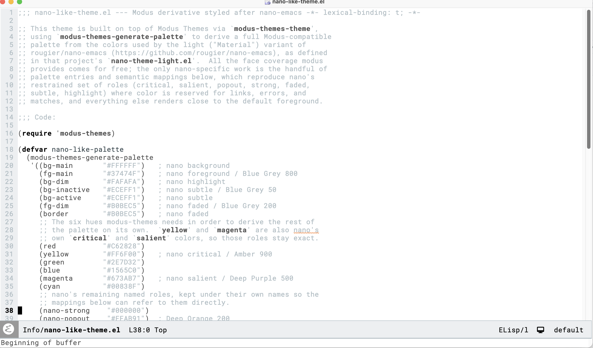

# nano

This theme is built on top of Modus Themes via `modus-themes-theme',
using `modus-themes-generate-palette' to derive a full Modus-compatible
palette from the colors used by the light ("Material") variant of
rougier/nano-emacs (https://github.com/rougier/nano-emacs), as defined
in that project's `nano-theme-light.el'.  All the face coverage modus
provides comes for free; the only nano-specific work is the handful of
palette entries and semantic mappings below, which reproduce nano's
restrained set of roles (critical, salient, popout, strong, faded,
subtle, highlight) where color is reserved for links, errors, and
matches, and everything else renders close to the default foreground.

# Installation

(use-package nano-like-modus-theme
    :vc (:url "https://github.com/benleis1/nano-like-modus-
    :config
   (load-theme 'folio t))

Sample



# Code:
<!-- markdown-toc start - Don't edit this section. Run M-x markdown-toc-refresh-toc -->
**Table of Contents**

- [nano](#nano)
- [Installation](#installation)
- [Code:](#code)
- [nano-like-theme.el ends here](#nano-like-themeel-ends-here)

<!-- markdown-toc end -->

```
(require 'modus-themes)

(defvar nano-like-palette
  (modus-themes-generate-palette
   '((bg-main       "#FFFFFF")   ; nano background
     (fg-main       "#37474F")   ; nano foreground / Blue Grey 800
     (bg-dim        "#FAFAFA")   ; nano highlight
     (bg-inactive   "#ECEFF1")   ; nano subtle / Blue Grey 50
     (bg-active     "#ECEFF1")   ; nano subtle
     (fg-dim        "#B0BEC5")   ; nano faded / Blue Grey 200
     (border        "#B0BEC5")   ; nano faded
     ;; The six hues modus-themes needs in order to derive the rest of
     ;; the palette on its own.  `yellow' and `magenta' are also nano's
     ;; own `critical' and `salient' colors, so those roles stay exact.
     (red           "#C62828")
     (yellow        "#FF6F00")   ; nano critical / Amber 900
     (green         "#2E7D32")
     (blue          "#1565C0")
     (magenta       "#673AB7")   ; nano salient / Deep Purple 500
     (cyan          "#00838F")
     ;; nano's remaining named roles, kept under their own names so the
     ;; mappings below can refer to them directly.
     (nano-strong    "#000000")
     (nano-popout    "#FFAB91")  ; Deep Orange 200
     (nano-faded     "#B0BEC5")
     (nano-subtle    "#ECEFF1")
     (nano-highlight "#FAFAFA"))
   'warm
   nil
   '((fg-heading-0 nano-strong) (fg-heading-1 nano-strong) (fg-heading-2 nano-strong)
     (fg-heading-3 nano-strong) (fg-heading-4 nano-strong) (fg-heading-5 nano-strong)
     (fg-heading-6 nano-strong) (fg-heading-7 nano-strong) (fg-heading-8 nano-strong)

     (keyword   nano-strong)
     (builtin   nano-strong)
     (type      unspecified)
     (fnname    fg-main)
     (variable  fg-main)
     (constant  fg-main)
     (number    fg-main)
     (comment   fg-dim)
     (string    fg-dim)
     (docstring fg-dim)

     (link         magenta)
     (link-visited magenta)
     (fg-prompt    magenta)

     (err     yellow)
     (warning nano-popout)
     (note    magenta)

     (bg-hl-line     nano-highlight)
     (bg-region      nano-subtle)
     (fg-region      unspecified)
     (bg-tab-bar     nano-subtle)
     (bg-tab-current bg-main)
     (bg-tab-other   nano-subtle)
     (bg-completion  nano-subtle)
     (bg-hover       nano-highlight)

     (bg-mode-line-active       nano-subtle)
     (fg-mode-line-active       nano-strong)
     (border-mode-line-active   nano-faded)
     (bg-mode-line-inactive     bg-main)
     (fg-mode-line-inactive     nano-faded)
     (border-mode-line-inactive nano-subtle)

     (fg-line-number-active   nano-strong)
     (fg-line-number-inactive nano-faded)

     (bg-paren-match nano-popout)
     (fg-paren-match nano-strong)
     (cursor         black)

     (bg-added   bg-yellow-subtle)
     (fg-added   yellow)
     (bg-removed bg-blue-subtle)
     (fg-removed blue)))
  "Modus-compatible palette generated from nano-emacs's light color set.")

(defcustom nano-like-palette-overrides nil
  "Overrides for the `nano-like' theme.
Follows the same shape as `modus-operandi-palette-overrides'."
  :type '(repeat (list symbol (choice symbol string)))
  :link '(info-link "(modus-themes) Palette overrides"))

(modus-themes-theme
 'nano-like
 'nano-like-themes
 "A light, minimal theme with color used sparingly, modeled on rougier/nano-emacs."
 'light
 'nano-like-palette
 nil
 'nano-like-palette-overrides)
```

####autoload
```
(when load-file-name
  (let ((dir (file-name-directory load-file-name)))
    (add-to-list 'custom-theme-load-path dir)))

(provide-theme 'nano-like)

(provide 'nano-like-theme)
```

# nano-like-theme.el ends here

> This file was auto-generated by elispdoc.el
